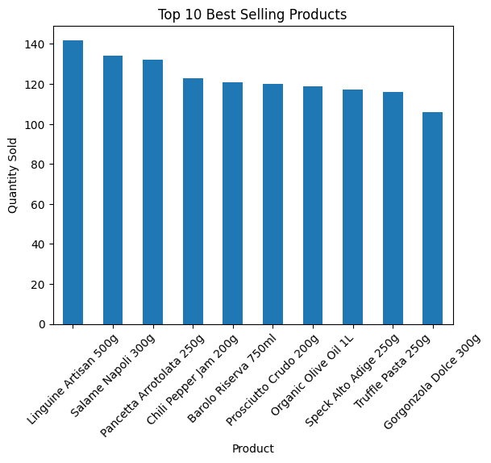
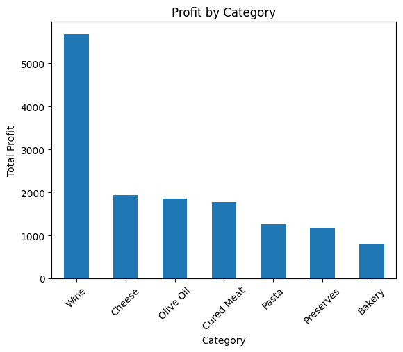
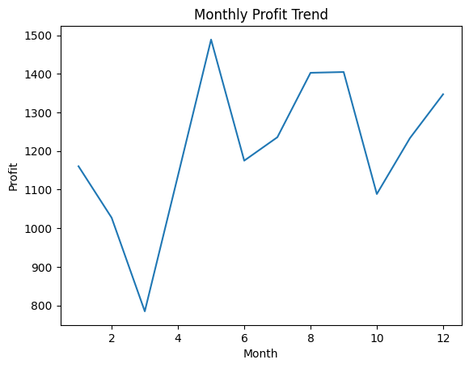

# 📊 Retail Sales Analysis

## 🧾 Project Overview

This project simulates a real-world retail sales and inventory analysis workflow for a small food and beverage business.

The main objective is to analyze sales performance, product profitability, inventory levels, and business trends using Python and data analysis libraries.

The project was designed as a portfolio case study for a Junior Data Analyst profile.

---

## 🎯 Objectives

* Perform data cleaning and preprocessing
* Analyze sales and inventory performance
* Identify top-selling products
* Analyze category profitability
* Explore monthly sales trends
* Detect low-stock inventory situations
* Practice real-world data analysis workflows

---

## 🛠 Technologies Used

* Python
* Pandas
* NumPy
* Matplotlib
* Jupyter Notebook
* Git & GitHub

---

## 📦 Dataset Features

The dataset includes simulated retail transaction data such as:

* Order ID
* Product Name
* Product Category
* Product Price
* Product Cost
* Quantity Sold
* Profit
* Stock Remaining
* Payment Method
* Order Date

The project uses realistic retail food products with different pricing ranges and profit margins.

---

## 📁 Project Structure

```text
retail-sales-analysis/
│
├── data/
│   ├── raw/
│   └── cleaned/
│
├── notebooks/
│   ├── 01_dataset_generation.ipynb
│   ├── 02_data_cleaning.ipynb
│   └── 03_exploratory_data_analysis.ipynb
│
├── visuals/
│
├── requirements.txt
├── README.md
└── .gitignore
```

---

## 🧹 Data Cleaning Process

The cleaning phase included:

* Handling missing values
* Standardizing category names
* Removing duplicate records
* Converting date columns to datetime format

The cleaned dataset was exported separately from the raw dataset to simulate a professional data workflow.

---

## 📈 Exploratory Data Analysis

The analysis focused on:

* Top-selling products
* Profit by category
* Monthly profit trends
* Inventory monitoring

---

## 💡 Key Insights

* Premium wine products generated high overall profit margins.
* Frequently purchased low-cost products contributed strongly to sales volume.
* Some inventory items frequently approached low stock levels.
* Product categories showed different profitability behaviors.

---

## 🖼 Sample Visualizations

### Top Selling Products



### Profit by Category



### Monthly Profit Trend



---

## 🚀 Future Improvements

Possible future improvements include:

* Interactive dashboard development
* Advanced KPI tracking
* Sales forecasting
* SQL database integration
* Streamlit dashboard implementation

---

## 👨‍💻 Author

**Francesco Di Cianni**

University student in Digital Business Informatics with a strong interest in Data Analysis, Artificial Intelligence, and business-oriented technology solutions.
