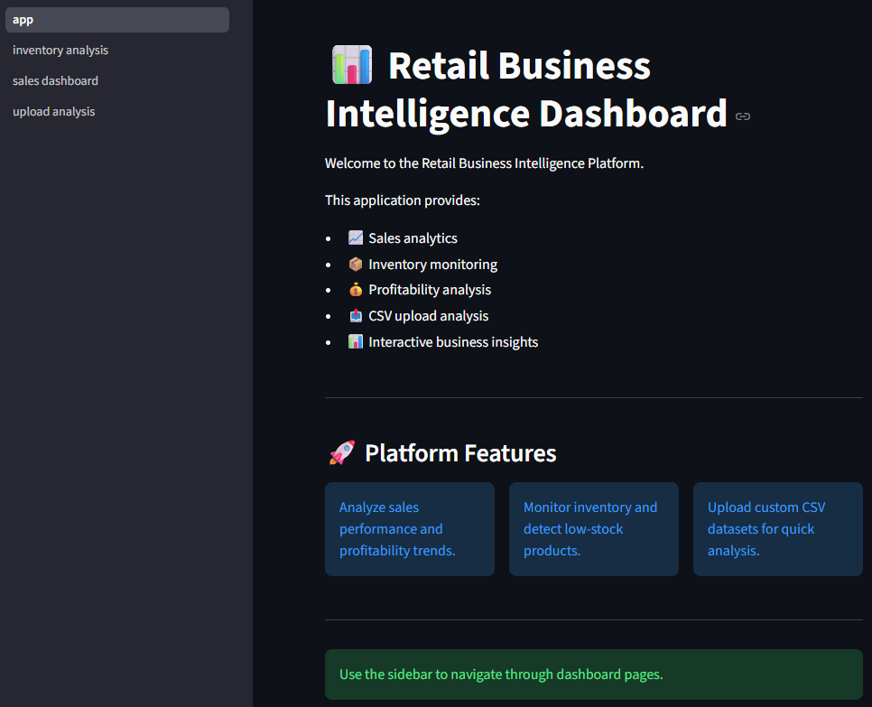
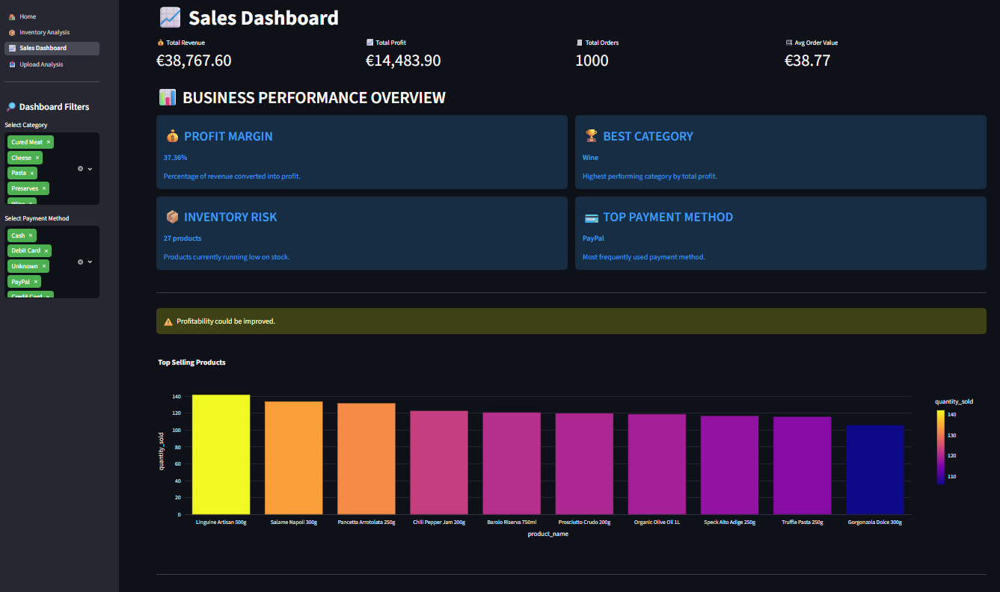
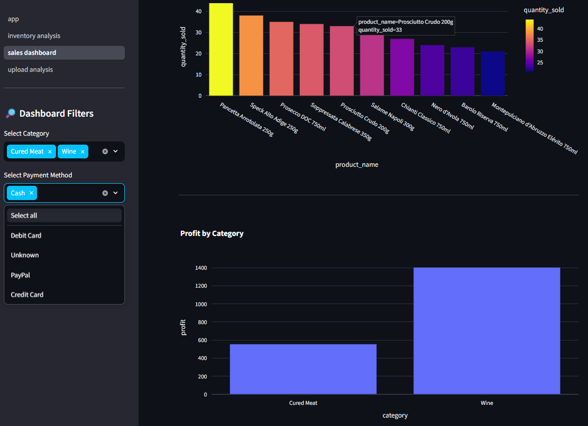
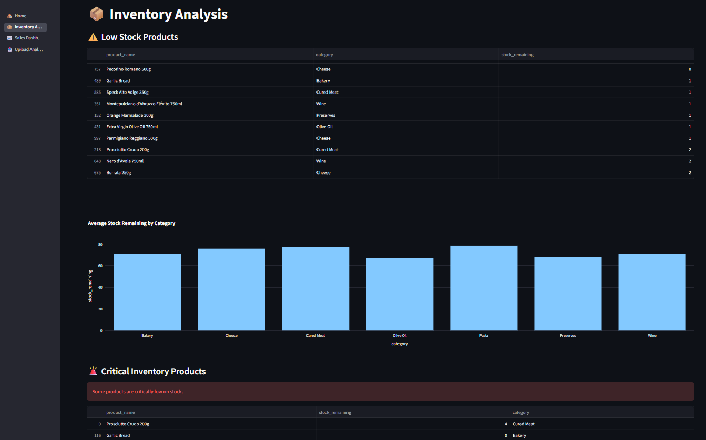
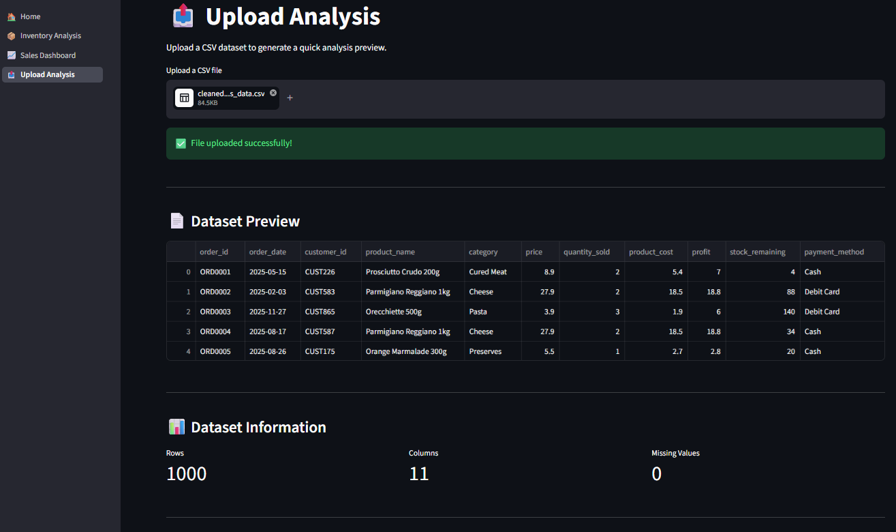

# 📊 Retail Business Intelligence Dashboard

[]()
[]()
[]()
[]()
[]()

An interactive retail analytics project built to simulate a real-world sales and inventory workflow for a small food and beverage business.

The project combines **data generation**, **data cleaning**, **exploratory analysis**, and a **Streamlit dashboard** to show how a Junior Data Analyst can transform raw business data into usable insights.

---

## ✨ Project Snapshot

This project was designed as a portfolio case study focused on a realistic retail environment with:

* sales transactions
* product profitability
* inventory monitoring
* category-level performance
* monthly trend analysis
* CSV upload analysis for external datasets

The goal was not to build a flashy toy dashboard. The goal was to build something that looks and behaves like a real business analytics tool, because apparently humans enjoy pretending spreadsheets are destiny.

---

## 🎯 Business Problem

Small retail businesses often struggle to answer questions like:

* Which products sell the most?
* Which categories generate the highest profit?
* Which items are running low in stock?
* How do sales behave over time?
* How can raw CSV data be turned into quick business insight?

This project was built to answer those questions using Python and a structured analytics workflow.

---

## 🚀 Live Dashboard Features

The Streamlit application includes:

* **Sales Dashboard** with KPI cards and interactive charts
* **Inventory Analysis** with low-stock alerts and critical inventory checks
* **Upload Analysis** to inspect any CSV file and generate quick insights
* **Sidebar filters** for category and payment method
* **Interactive Plotly visualizations**
* **Dynamic business messages** based on performance indicators

---

## 🛠️ Tech Stack

* **Python**
* **Pandas**
* **NumPy**
* **Matplotlib**
* **Plotly**
* **Streamlit**
* **Jupyter Notebook**
* **Git & GitHub**

---

## 🧱 Project Architecture

```text
retail-sales-analysis/
│
├── app/
│   ├── app.py
│   ├── pages/
│   │   ├── sales_dashboard.py
│   │   ├── inventory_analysis.py
│   │   └── upload_analysis.py
│   ├── components/
│   │   ├── charts.py
│   │   ├── filters.py
│   │   └── kpi_cards.py
│   └── utils/
│       └── data_loader.py
│
├── data/
│   ├── raw/
│   └── cleaned/
│
├── notebooks/
│   ├── 01_dataset_generation.ipynb
│   ├── 02_data_cleaning.ipynb
│   └── 03_exploratory_data_analysis.ipynb
│
├── visuals/
│
├── requirements.txt
├── README.md
└── .gitignore
```

---

## 📦 Dataset Overview

The dataset simulates a retail food business and includes realistic transaction-level fields such as:

* Order ID
* Product Name
* Category
* Price
* Product Cost
* Quantity Sold
* Profit
* Stock Remaining
* Payment Method
* Order Date

The product catalog was designed with realistic packaging sizes, pricing ranges, and margin differences to make the analysis more credible and business-oriented.

---

## 🧹 Data Workflow

The project follows a simple but professional workflow:

### 1. Dataset Generation

A synthetic sales dataset is created to simulate retail operations.

### 2. Data Cleaning

The raw dataset is cleaned by handling missing values, standardizing category names, removing duplicates, and preparing the data for analysis.

### 3. Exploratory Data Analysis

The cleaned dataset is explored through aggregations, charts, and business insights.

### 4. Streamlit Dashboard

The cleaned data is displayed inside an interactive dashboard for easier navigation and analysis.

---

## 📈 Analytics Covered

### Sales Performance

* Top-selling products
* Revenue and profit metrics
* Average order value
* Monthly trend analysis

### Inventory Monitoring

* Low-stock products
* Critical inventory alerts
* Category-level stock distribution

### Business Intelligence

* Category profitability
* Payment method analysis
* Dynamic insights based on filtered data
* CSV upload analysis for external datasets

---

## 💡 Key Insights

* Premium products contribute disproportionately to profit.
* Lower-cost items tend to drive higher sales volume.
* Certain product categories are more profitable than others.
* Some stock items require closer monitoring to avoid shortages.
* Filter-driven analysis makes it easier to isolate patterns by product category and payment method.

---

## 🖼️ Dashboard Preview

### 🏠 Homepage



---

### 📈 Sales Dashboard



---

### 🔎 Interactive Filters



---

### 📦 Inventory Analysis



---

### 📤 Upload Analysis



## ▶️ How to Run the Project

### 1. Clone the repository

```bash
git clone https://github.com/your-username/retail-sales-analysis.git
cd retail-sales-analysis
```

### 2. Create and activate a virtual environment

```bash
python -m venv venv
venv\Scripts\activate
```

### 3. Install dependencies

```bash
pip install -r requirements.txt
```

### 4. Run the Streamlit dashboard

```bash
streamlit run app/app.py
```

### 5. Explore the notebooks

Open the notebooks in Jupyter for the dataset generation, cleaning, and EDA workflow.

---

## 🧠 What I Learned

This project helped me practice:

* structuring a data project professionally
* cleaning messy data
* generating insights from transaction datasets
* building dashboards with Streamlit
* creating reusable components
* using Plotly for interactive charts
* organizing a GitHub portfolio like an actual developer would, which is apparently rare enough to be a skill

---

## 🔮 Future Improvements

Possible next steps for the project:

* deploy the dashboard online with a cloud service
* add more advanced KPI sections
* introduce forecasting logic for sales trends
* improve inventory risk scoring
* expand the upload analysis into an automated business report generator
* integrate SQL for storage and querying

---

## 👨‍💻 Author

**Francesco Di Cianni**

Junior Data Analyst / AI & Operations oriented profile, with a strong interest in Python, business analytics, and practical portfolio development.

---

## ⭐ Final Note

This project was built to be understandable, realistic, and presentable in a professional portfolio. It focuses on business logic, data quality, and useful analytics rather than unnecessary complexity.

That is usually what recruiters actually care about, despite the internet’s obsession with making every project sound like an apocalypse-proof AI moonshot.

